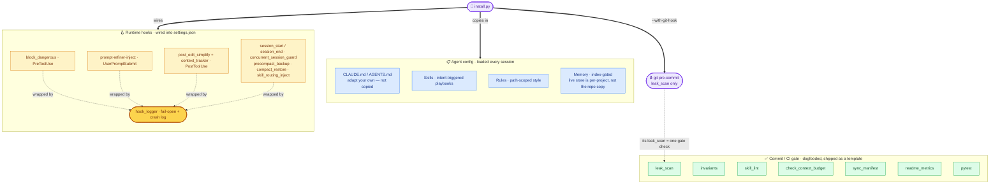

<div align="center">

# Agent Workbench

### Skills, rules, hooks, and tooling for running an AI coding agent reliably on a long-lived codebase

*Bộ công cụ + phương pháp luận làm việc với Claude Code — rút ra từ một codebase production thật, đã domain-stripped.*

[](https://github.com/doivamong/agent-workbench/actions/workflows/ci.yml)
[](LICENSE)
[](#at-a-glance)

<kbd>[Try it](#fastest-proof)</kbd> · <kbd>[Getting started](docs/getting-started.md)</kbd> · <kbd>[What's inside](#whats-inside)</kbd> · <kbd>[Quickstart](#quickstart-5-minutes)</kbd> · <kbd>[Install](#install-it-into-your-own-project)</kbd> · <kbd>[Honesty](#status--honesty)</kbd> · <kbd>[🇻🇳 Tiếng Việt](docs/README.vi.md)</kbd>

</div>

---

## What is this?

A drop-in kit that keeps an AI coding agent (Claude Code & others) **consistent and safe** on a
codebase you maintain for months — skills, path-scoped rules, fail-open hooks, and stdlib-only
guard tools, installed in one command.

- **What it is (and isn't)** — the generic, reusable layer pulled from one real private codebase: a
  copy-pasteable kit of small, independent, opt-in pieces. **Not a framework, not a security
  product** — and the guards state what they do **not** defend against.
- **What you get** — skills + rules + hooks + stdlib guard tools, wired in by one command.
- **Why trust it** — the command blocker and leak scanner are *seatbelts, not security boundaries*;
  every guard says what it does not do. ([Honest by design ↓](#honest-by-design))

New here? **[See it work in 30 seconds — no install ↓](#fastest-proof)** — or pick your path:

## Choose your path

| You are… | Read in this order |
|---|---|
| **New to Claude Code** | [getting-started](docs/getting-started.md) → [workflow](docs/workflow.md) → [SECURITY](docs/SECURITY.md) |
| **A power user sizing it up** | [SKILL_CATALOG](SKILL_CATALOG.md) → [skills README](.claude/skills/README.md) → [workflow](docs/workflow.md) |
| **Installing it into your repo** | [Fastest proof ↓](#fastest-proof) → `python install.py --dry-run` → [memory-governance](docs/memory-governance.md) |
| **Người Việt mới bắt đầu** | [README.vi](docs/README.vi.md) → [Thuật ngữ](docs/README.vi.md#thuật-ngữ-nhanh) → [getting-started](docs/getting-started.md) |

## Honest by design

> Every guard states what it does **not** do. `block_dangerous` and `leak_scan` are seatbelts
> against accidents, **not security boundaries** — they fail *closed* on anything they can't parse,
> and a determined operator can evade any string matcher. `secrets_guard` is a stdlib construction,
> **not an audited crypto library** — use `age`/`sops` if your threat model is adversarial. Every
> capability is tagged **LIVE / BLUEPRINT / ADOPTER-FILLS / REJECTED** in
> [`SKILL_CATALOG.md`](SKILL_CATALOG.md), so you always know what runs vs. what you build. Full
> threat model: [`docs/SECURITY.md`](docs/SECURITY.md); the standing limits sit in
> [Status & honesty ↓](#status--honesty).

## Fastest proof

The core is **stdlib-only** — prove it runs *before* you `pip install` anything:

```bash
git clone https://github.com/doivamong/agent-workbench && cd agent-workbench

python examples/hook_block_demo.py    # see dangerous commands get blocked — no install
python tools/leak_scan.py . --respect-gitignore   # the repo scans itself
```

> **You should see:** the classifier marks `git status`, `git push origin main`, `pytest` as
> allowed and `rm -rf /`, `git push … --force`, `DROP TABLE` as **BLOCKED**, ending with
> `All classifications correct.` — and leak_scan prints `0 finding(s)`. **No `pip` yet — that's the
> point: the core is stdlib-only.**

<details>
<summary><b>What the run actually prints</b> (abbreviated)</summary>

```text
$ python examples/hook_block_demo.py
BLOCKED?  EXPECTED  COMMAND
------------------------------------------------------------
False     False     git status  [OK]
False     False     pytest tests/  [OK]
True      True      rm -rf /   [OK]
True      True      git push origin main --force   [OK]
True      True      DROP TABLE users;   [OK]

All classifications correct.

$ python tools/leak_scan.py . --respect-gitignore
0 finding(s) across 182 file(s).
```
</details>

For the full setup, jump to the [Quickstart](#quickstart-5-minutes) below, or follow the guided
[10-minute walkthrough](docs/getting-started.md).

---

> **The problem.** Most Claude Code advice is toy examples. The hard part of using an AI
> agent isn't a clever one-off prompt — it's keeping the agent **consistent, safe, and
> on-pattern** across hundreds of sessions on a codebase you actually have to maintain.

> **The approach.** Encode the recurring decisions *once* — as intent-triggered skills,
> path-scoped rules, fail-open hooks, a carried-forward memory, and greppable invariant
> checks — so the agent re-derives them every session instead of you re-explaining them.

> **The result.** A copy-pasteable kit that installs into any project in one command and
> starts blocking dangerous shell commands, refining vague prompts, and gating commits
> immediately. Core is **stdlib-only**, the demos run in seconds, and CI is green.

---

## Why this exists

🇻🇳 *Tóm tắt — Lớp phương pháp luận generic rút ra từ một codebase production riêng tư (không bao giờ công khai được): phần giúp chạy một agent AI **đáng tin, an toàn, nhất quán** trên codebase sống lâu dài, đã gỡ sạch mọi dấu vết domain. Công khai để ai cần thì dùng lại và né những sai lầm tránh được — không phải để lấy sao.*

> **Canonical statement:** the four tenets and the "what would betray this" review checklist live
> in [`PHILOSOPHY.md`](PHILOSOPHY.md) — the source of truth. This section is their narrative form.

This kit is the **generic, reusable layer** extracted from a real single-developer project —
the parts that have nothing to do with the original business domain and everything to do with
**making an AI coding agent reliable, safe, and consistent over a long-lived codebase.**

It is deliberately **domain-stripped**. Every business identifier, secret, machine path, and
piece of customer data has been removed and verified with a leak scanner (see
[`docs/SANITIZATION.md`](docs/SANITIZATION.md)). What remains is methodology you can lift.

> **Why it's public — and why it isn't about stars.** The private codebase this came from can never
> be public; the methodology inside it is too useful to stay buried. It isn't optimized for stars or
> traction — only to be **available, correct, and honest** the day someone reaches for it. (The full
> reasoning is tenet 2 in [`PHILOSOPHY.md`](PHILOSOPHY.md).)

> **Honesty is the deal, not decoration.** Because the point is to spare you avoidable pain, every
> tool states plainly what it does *not* do (see [Status & honesty](#status--honesty) and
> [`docs/SECURITY.md`](docs/SECURITY.md)). A guardrail that oversold itself would cause the exact
> stumble it is meant to prevent. The standard everywhere here: **best-fit, honest about limits,
> not gospel.**

**Who it's for** — solo developers (or tiny teams) who use an AI agent as their primary
pair-programmer, maintain code long enough that **consistency** and **guardrails** matter
more than raw speed, and want concrete copy-pasteable patterns instead of abstract advice.

## What's inside

🇻🇳 *Tóm tắt — Bản đồ theo nhu cầu ("khi bạn cần làm X → cái này cho bạn gì"), không phải danh sách endpoint: cấu hình agent (CLAUDE/AGENTS), hệ skills, memory, hooks bắt footgun, và bộ tool stdlib. Chi tiết kỹ thuật nằm ở các đường link.*

A benefit-first map — *what it helps you do*, not an endpoint dump. Technical detail is
deferred to the linked paths and the [deep-dives below](#how-it-fits-together).

| When you need to… | What this gives you | Path |
|---|---|---|
| **Configure the agent itself** | Drop-in `CLAUDE.md` + `AGENTS.md` templates and path-scoped rules — short, high-signal, loaded every session, portable across AI tools | [`CLAUDE.md`](CLAUDE.md) · [`AGENTS.md`](AGENTS.md) · [`.claude/rules/`](.claude/rules/) |
| **Encode reusable workflows** | A skill system with tiers, a registry, and seventeen runnable skills (plan-then-code, research, review, debug, tdd, …) the agent invokes by intent | [`.claude/skills/`](.claude/skills/) |
| **Catch footguns at runtime** | Fail-open hooks that block common destructive shell commands (a *seatbelt*, **not a security boundary**), flag vague prompts, and nudge a simplify pass — a crash logs and exits clean, never halting you | [`.claude/hooks/`](.claude/hooks/) |
| **Carry memory across sessions** | A file-based memory scaffold (example facts to replace; live recall reads a per-project path, **not** this repo's `memory/`) plus tools to keep it honest, snapshot/restore it, check it reaches the agent, and publish a public-safe slice (**fail-closed**) | [`memory/`](memory/) · [`tools/`](tools/) |
| **Gate commits & CI honestly** | A leak/identifier scanner (a commit-time *seatbelt* with an opt-in entropy sweep), an invariant framework, an AST test-selector, a README-count gate, and a file-set manifest — plus a ready [`.pre-commit-config.yaml`](.pre-commit-config.yaml) | [`tools/`](tools/) |
| **Encrypt secrets at rest** | A stdlib file encryptor (HMAC-CTR + PBKDF2) — a **custom construction, not an audited crypto library**; fine for at-rest backups, but use `age`/`sops`/libsodium for a real adversarial threat model | [`scripts/secrets_guard.py`](scripts/secrets_guard.py) |
| **Vet code & measure cost** | A license/attribution scan (**reads markers, not meaning** — a clean result isn't proof of authorship), a context-budget auditor (**heuristic, not a real tokenizer**), and a skill-usage report (**counts mentions, not uses**) | [`tools/license_scan.py`](tools/license_scan.py) · [`tools/check_context_budget.py`](tools/check_context_budget.py) |
| **Operate this repo** | Cross-platform stdlib `ops/` tools — control the opt-in dashboard (start/stop/restart/status), pack a **verifiable release zip** (sha256 manifest = integrity, not authenticity), and snapshot/restore the working tree (gitignore-respecting, dry-run by default). Engine for the dashboard's admin layer | [`ops/`](ops/) |
| **Try any of it in ~30 seconds** | Every tool ships a runnable `examples/` entry | [`examples/`](examples/) |

**Full per-capability list with `LIVE` / `BLUEPRINT` / `ADOPTER-FILLS` / `REJECTED` status →
[`SKILL_CATALOG.md`](SKILL_CATALOG.md).**

## How it fits together

🇻🇳 *Tóm tắt — Lõi tái dùng là vài mảnh nhỏ, độc lập, opt-in mà installer thả vào dự án đích. Không phải framework — mỗi mảnh đứng riêng được.*

The reusable core is a handful of small, independent pieces that the installer drops into a
target project. Nothing here is a framework — each part stands alone and is opt-in.



<details>
<summary><b>Deep-dive: the skill system (tiers, registry & skills)</b></summary>

Skills are intent-triggered playbooks. The registry classifies each into a **tier** so the
agent knows which takes precedence when several match. Seventeen runnable skills ship as
working references:

| Skill | Tier | Fires when | Role |
|---|---|---|---|
| `awb-plan-then-code` | workflow | "implement X", multi-file work needing a plan first | Orchestrates a full plan → implement → review flow |
| `awb-review` | guard | "review my changes", before a non-trivial commit | Gates quality on changed code |
| `awb-debug` | guard | "it's broken / erroring" with an unknown cause | Maps symptom → suspect files before any fix |
| `awb-research` | workflow | "how should we / what's the best way", comparing approaches | Reads the code, compares ≥2 options, recommends before building |
| `prompt-refiner` | workflow | a vague, multi-part request (flagged by the `prompt-refiner-inject.py` hook) | Restates intent into a crisp spec before work starts |
| `awb-handover` | workflow | ending a session, "package this for the next session / write a handover" | Packages settled work into artifacts a cold reader can execute |
| `awb-stress-test` | workflow | "stress test this / what could go wrong / edge cases", before building or testing | Runs a change past fixed lenses for a GO/CAUTION/STOP verdict and an edge-case list |
| `awb-output-guard` | guard | generating a whole file / large refactor | Stops truncation, placeholders, and "for brevity" stubs in long output |
| `awb-using-skills` | meta | auto-injected each session; ≥2 skills could match, or unsure any applies | Routes to the right skill (tier precedence, match the object not the verb) |
| `awb-config-guard` | guard | writing code that reads config (a nested key, or a cross-context read) | Advisory layer over the deterministic `config-flat-access` invariant — catches the silent-None trap |
| `awb-tdd` | workflow | "do this TDD / test-first / red-green-refactor" | One failing test → minimal code → repeat, in vertical slices; guards the silent-skip trap |
| `awb-cook` | workflow | "cook this / full workflow with checkpoints / plan from a few angles" | Graduated oversight + multi-perspective plan, orchestrating the guard skills |
| `awb-external-ref` | workflow | about to copy/adapt outside code ("can we use this / port this") | Classify the licence → port-with-notice or salvage-the-concept; injection + supply-chain checks |
| `awb-optimize` | feature | "it's too slow / optimize / cut latency" with a measurable goal | Baseline → measure → fix the top bottleneck → re-measure → before/after table |
| `awb-dead-code-audit` | audit | "find unused / dead code", a post-refactor prune | Calls a symbol dead only when every independent cross-check is empty; never auto-deletes |
| `awb-lessons-capture` | workflow | end of a session, "capture the lessons / memory retro", after a surprising bug or correction | Mines the session for durable lessons, scores each, writes only the approved ones to live memory |

The registry ([`.claude/skills/skill-registry.md`](.claude/skills/skill-registry.md)) is the
single grep-able index of trigger / do-not-trigger boundaries; the
[`SKILL_TEMPLATE.md`](.claude/skills/SKILL_TEMPLATE.md) is the starting point for your own.

</details>

<details>
<summary><b>Deep-dive: hooks are fail-open by design</b></summary>

Every hook is wrapped so that a crash **never blocks your workflow** — it logs to a JSONL
crash file and exits cleanly, rather than wedging the agent. The shipped hooks:

| Hook | Event | What it does |
|---|---|---|
| `block_dangerous.py` | `PreToolUse` (Bash) | Catches common destructive command shapes — `rm -rf` (any flag order/spacing), `find -delete`, `dd`, `mkfs`, fork bombs, force-push, `DROP TABLE`, … — and denies them via the documented hook contract. A **seatbelt against accidents, not a security boundary** (a determined operator can evade any string matcher). Adversarial evasion cases are in the test suite. |
| `prompt-refiner-inject.py` | `UserPromptSubmit` | Flags vague prompts to be refined before execution |
| `post_edit_simplify.py` | `PostToolUse` (Edit/Write) | After a burst of edits, nudges a simplification pass (dead code, unused imports, over-long functions, DRY). Throttled by a cooldown and a session TTL so it nudges occasionally, never spams. Advisory only — never blocks. |
| `precompact_backup.py` | `PreCompact` | Backs up the transcript and writes a `.last_compact` signal before a compaction, so context is recoverable even if you didn't save. |
| `compact_restore.py` | `SessionStart` (compact) | After a compaction, re-injects the top of the newest handover so the agent resumes with goal/decisions/next-steps. |
| `skill_routing_inject.py` | `SessionStart` (all) | Injects a compact, tier-ordered routing map derived from `skill-registry.md`, so the agent starts each session knowing which skill fires when. Output is kept small (it loads every session); pairs with the `awb-using-skills` meta-skill. |
| `sync_guard.py` | `PostToolUse` (Write) | **Maintainer-only — not wired by the installer** (its `tools/sync_manifest.py` gate and `.claude/manifest.json` ship with the kit, not into adopter projects, so wiring it there would only nag). When a Write creates a *new* file in a watched source-of-truth dir, nudges you to update its dependents and regenerate the manifest. Distinguishes new-file from edit via `.claude/manifest.json`, so content edits stay quiet. Advisory; the deterministic gate is `tools/sync_manifest.py --check`. |
| `context_tracker.py` | `PostToolUse` (all) | As a session grows long, nudges you to `/compact` or to save a handover before limits hit. Throttled; counts are per-project. |
| `session_start.py` | `SessionStart` (startup\|resume\|clear) | Injects the project primer (`.claude/session-primer.md`) — a short, stable pointer ("you have skills; here's the registry; pick by the trigger markers") — at the top of each session, and surfaces the `session_end.py` breadcrumb as a "Last session: …" line. Does **not** fire on `compact` (that's `compact_restore.py`). Kill-switch `SESSION_PRIMER=0`. |
| `concurrent_session_guard.py` | `SessionStart` (startup\|resume\|clear) | Warns when a **second** session attaches to a checkout that already has a live one — two sessions on one working tree race the shared git index/HEAD and can corrupt `.git/config`. Writes a per-worktree lock (`.claude/.logs/session_lock.json`, gitignored) recording the agent process; a stale lock (dead pid) is silently reclaimed, and `session_end.py` releases it. A **seatbelt, not a lock** — it warns after a second session attaches, it cannot prevent one, and it fails toward silence (a missed warning), never a false alarm. Advisory only; never blocks. Kill-switch `SESSION_LOCK_GUARD=0`. |
| `session_end.py` | `SessionEnd` | Writes a one-line breadcrumb (git branch, last commit, uncommitted count, time) when a session ends; `session_start.py` surfaces it next time as a "Last session: …" line. A lightweight, automatic complement to a hand-written handover — orientation, not a replay. Also releases this session's concurrent-session lock. Kill-switch `SESSION_BREADCRUMB=0`. |
| `skill_usage_logger.py` | `UserPromptSubmit` | **Opt-in — not wired by default.** Logs which skills a prompt names (an explicit `/<skill>` as a strong "invoke", a bare name as a weak "mention") to a local, gitignored JSONL for [`tools/skill_usage_report.py`](tools/skill_usage_report.py) to summarize. Enable by adding it to the `UserPromptSubmit` chain in `.claude/settings.json`. |

The fail-open wrapper lives in [`.claude/hooks/lib/hook_logger.py`](.claude/hooks/lib/hook_logger.py).
Run [`examples/hook_block_demo.py`](examples/hook_block_demo.py) to see the classifier decide.

</details>

## Generic vs. domain-specific — read this first

🇻🇳 *Tóm tắt — Bộ kit này là nửa **GENERIC** của một codebase riêng tư lớn hơn. Bảng dưới trung thực về cái gì mang đi được (ở đây) và cái gì cố ý để lại (logic domain riêng tư).*

This kit is the **GENERIC** half of a larger private codebase. The table is honest about
what's transferable and what was intentionally left behind:

| Transferable (here) | Left behind (domain-specific, not shareable) |
|---|---|
| Hook architecture (fail-open, crash-logged) | Application routes + domain data-access code |
| `secrets_guard` crypto | The project's domain business logic |
| Invariant *framework* | The project's concrete invariant rules |
| Memory governance *model* | The actual memory corpus |
| Prompt-refiner *mechanism* | The project's domain prompt vocabulary |

## At a glance

🇻🇳 *Tóm tắt — Các con số ở bảng dưới đều được CI tự kiểm (`readme_metrics`) nên không thể lệch âm thầm: lõi **0 phụ thuộc**, bộ test xanh, đủ demo/skills/tool. Bản tiếng Anh này là nguồn số liệu chuẩn (được gate).*

<!-- BEGIN GENERATED:metrics (hand-maintained; run `python -m pytest --co -q` to recount tests) -->

| Signal | Value |
|---|---|
| Reusable core dependencies | **0** (stdlib-only) |
| Tests | **770**, green in CI (incl. adversarial evasion cases for the command guard) |
| Runnable demos | **28** (`examples/`) |
| Skills | **17** (10 workflow + 4 guards + 1 meta + 1 feature + 1 audit) |
| Standalone tools | **20** (`invariants`, `affected_tests`, `leak_scan`, `license_scan`, `secrets_guard`, `memory_audit`, `memory_snapshot`, `memory_recall_doctor`, `memory_budget`, `memory_sync`, `memory_eval`, `skill_lint`, `check_context_budget`, `check_requirements_diff`, `sync_manifest`, `skill_usage_report`, `readme_metrics`) |

<!-- END GENERATED:metrics -->

> The test count is mirrored in three places (this row, the Quickstart comment, the footer).
> `tests/test_readme_metrics.py` guards against drift — it collects the suite and fails CI if any
> advertised number is stale, so the figure can't silently rot when you add tests.

## Quickstart (5 minutes)

🇻🇳 *Tóm tắt — Clone → cài (lõi không phụ thuộc) → chạy thử từng demo (vài giây mỗi cái) → chạy bộ test để tự chứng minh các tool hoạt động.*

```bash
git clone https://github.com/doivamong/agent-workbench
cd agent-workbench
python -m pip install -r requirements.txt   # stdlib-only core; deps are for examples/tests

# See it work (each runs in seconds):
python examples/secrets_demo.py     # encrypt/decrypt round-trip + tamper detection
python examples/hook_block_demo.py  # dangerous-command classifier
python examples/post_edit_simplify_demo.py  # the simplify-nudge classifier
python examples/invariant_demo.py   # the invariant gate
python examples/memory_audit_demo.py  # memory hygiene tripwire
python examples/skill_lint_demo.py    # registry/skill drift check
python examples/memory_snapshot_demo.py  # snapshot/restore a memory dir
python examples/memory_recall_doctor_demo.py  # does curated memory reach the agent?
python examples/context_budget_demo.py   # audit this repo's context budget
python examples/requirements_diff_demo.py # warn on a newly added dependency
python examples/affected_tests_demo.py   # pick only the tests a change affects
python examples/sync_manifest_demo.py     # file-set drift gate (added/removed files)
python examples/install_doctor_demo.py    # prove wired hooks actually run (--doctor)

# Prove the tools actually work:
python -m pytest -q                 # 770 tests
```

## Install it into your own project

🇻🇳 *Tóm tắt — Trỏ installer vào dự án bất kỳ: nó chép hooks/skills/rules/tool/`secrets_guard` + scaffold memory rồi tự wire hooks. Mở dự án bằng agent là có ngay: chặn lệnh Bash nguy hiểm, gắn cờ prompt mơ hồ, và (tuỳ chọn) gate commit chống rò rỉ.*

This is the part that makes it real, not just a reference. Point the installer at any project
and it copies the hooks, skills, rules, the project-facing tools (8 of the 16 in `tools/` — the
other 8 are repo-maintenance tools that stay in the kit), `secrets_guard` (the 17th tool counted in
"At a glance" — it lives in `scripts/`, not `tools/`), and the memory scaffold
in, then wires the hooks for you:

```bash
python install.py /path/to/your/project --with-git-hook --merge-settings
# --merge-settings deep-merges the hooks into .claude/settings.json (idempotent —
#   safe to re-run, preserves your other settings). Omit it to print the snippet
#   to paste yourself instead.
# --dry-run to preview first; --force to overwrite existing copied files.
```

**Prefer to just talk to Claude Code?** Clone agent-workbench and open that folder in Claude Code,
then say *"install agent-workbench into `<path-to-my-project>` and confirm the guards are on"* — the
agent (skill `awb-install-and-verify`) runs the install above against your project, then
`install.py <project> --doctor` to prove the guards fire, and reports honestly what's protected and
what isn't. It runs **from the kit folder**, not from inside your empty project (the tools aren't there yet).

**Install only what you want, and uninstall cleanly.** Groups are `hooks`, `skills`, `rules`,
`agents`, `tools`, `memory`; dependencies are pulled in automatically (selecting `hooks` adds
`skills`, so routing has something to route to):

```bash
python install.py /path/to/your/project --select hooks,skills   # only these groups (+deps)
python install.py /path/to/your/project --list                  # what's available / installed
python install.py /path/to/your/project --doctor                # verify the wired guards actually fire
python uninstall.py /path/to/your/project                       # dry run — shows the plan
python uninstall.py /path/to/your/project --yes                 # reverse the install
```

The installer records what it copied in a git-ignored `.claude/installer-manifest.json`, so
`uninstall.py` removes exactly that and **keeps any file you edited** (it never deletes your
changes, and fails loud rather than guessing if the manifest is missing). On a fresh repo,
`install` then `uninstall --yes` leaves `git status` clean.

With `--merge-settings` the installer's hooks are active immediately — every hook in the table
above except the maintainer-only `sync_guard` and the opt-in `skill_usage_logger`; without it you
paste the printed snippet into `.claude/settings.json` yourself. Either way, opening that project
in your agent gives you, working immediately:

- **Dangerous `Bash` commands get blocked** (force-push, `rm -rf /`, `DROP TABLE`, …) via a
  real `PreToolUse` hook — verified against the documented hook I/O contract.
- **Vague prompts get flagged** to be refined first, via a `UserPromptSubmit` hook.
- **A git pre-commit gate** (`--with-git-hook`) that refuses to commit a leaked secret.
- **Drop-in skills** under `.claude/skills/` and a **working memory folder** under `memory/`.

Then make it yours: replace these skills with your own, put your real rules in
[`tools/invariants.py`](tools/invariants.py), and list your project's identifiers in a private
deny-list for [`tools/leak_scan.py`](tools/leak_scan.py).

## Documentation

🇻🇳 *Tóm tắt — Bảng tra cứu: đọc file nào, khi nào. Người đọc tiếng Việt xem bản dịch đầy đủ ở [docs/README.vi.md](docs/README.vi.md).*

> *Lost? Use the [persona router](#choose-your-path) up top. The maps below are reference depth:
> **[SKILL_CATALOG](SKILL_CATALOG.md)** = every capability by status · **[What's inside](#whats-inside)**
> = by need · **[workflow.md](docs/workflow.md)** = by task · **[skills README](.claude/skills/README.md)**
> = by tier.*

| Group | Key file | When to read |
|---|---|---|
| **Start here** | [`docs/getting-started.md`](docs/getting-started.md) | First clone — guided walkthrough |
| **Map** | [`SKILL_CATALOG.md`](SKILL_CATALOG.md) | The full capability taxonomy — every skill/hook/doc/placeholder tagged LIVE / BLUEPRINT / ADOPTER-FILLS / REJECTED |
| **Security** | [`docs/SECURITY.md`](docs/SECURITY.md) | What each guard does / does NOT defend against |
| **Blueprint** | [`docs/memory-governance.md`](docs/memory-governance.md) | Reference design for cross-session memory — the repo ships the `memory/` scaffold; the governance tooling is a model you implement |
| **Design + hooks** | [`docs/session-preservation.md`](docs/session-preservation.md) | Context handover on long projects — the automatic layers ship as hooks (PreCompact backup, post-compact restore, context-budget nudge); the `/session-save` commands and the HANDOVER you write stay manual |
| **Guide** | [`docs/sub-agents.md`](docs/sub-agents.md) | The sub-agent convention + the shipped `silent-failure-hunter` (an error-handling reviewer you spawn on demand; adapted from Anthropic's pr-review-toolkit, Apache-2.0) |
| **Guide** | [`docs/orchestration.md`](docs/orchestration.md) | How to delegate to sub-agents — when it pays off, briefing one that can't see your chat, a status protocol, and writing big outputs to disk |
| **Guide** | [`docs/lessons-as-rules.md`](docs/lessons-as-rules.md) | Turning a hard-won mistake into a path-scoped rule — the rule shape, promotion from memory, and the periodic anti-bloat cull |
| **Guide** | [`docs/development-rules.md`](docs/development-rules.md) | Everyday coding defaults (YAGNI/KISS/DRY, error handling, testing) — guidance, not law, and what yields when a path-scoped rule disagrees |
| **Guide** | [`docs/workflow.md`](docs/workflow.md) | Which skills to chain for which task type, and what the hooks fire on their own — the routing map over the skill set |
| **Guide** | [`docs/architecture-vocabulary.md`](docs/architecture-vocabulary.md) | A small domain-free vocabulary for *structural* quality — deep vs shallow module, seam, the deletion test, interface-as-test-surface |
| **Blueprint** | [`docs/ui-redesign-workflow.md`](docs/ui-redesign-workflow.md) | UI redesign as a gated workflow (admin + public toggle) — front-load the cheap checks; ships the method, you fill the brand |
| **Guide** | [`docs/design-discipline.md`](docs/design-discipline.md) | Make UI quality explicit, not a vibe — numeric design dials, a scan→diagnose→fix audit, anti-AI-slop rules, a11y/perf as hard rules |
| **Guide** | [`docs/external-tool-reliability.md`](docs/external-tool-reliability.md) | Trust an external analysis tool only after benchmarking it — ban its 0%-accurate queries, degrade gracefully to grep |
| **Guide** | [`docs/pre-commit-failure-modes.md`](docs/pre-commit-failure-modes.md) | A commit gate that learns — an append-only failure-modes registry plus advisory-vs-blocking tiering |
| **Guide** | [`docs/windows-agent-gotchas.md`](docs/windows-agent-gotchas.md) | Silent failures specific to driving an agent on Windows — `.bat` swallowed by `cmd /c`, headless `sys.stdout=None`, "restart didn't take" (stale PID/elevation), `requirements.txt` ≠ deployed |
| **Pattern** | [`docs/patterns/config-access.md`](docs/patterns/config-access.md) | Two config-access traps — the wrong accessor for the execution context, and the silent-`None` nested-key bug that detonates far downstream |
| **Pattern** | [`docs/patterns/optimization-loop.md`](docs/patterns/optimization-loop.md) | Let a measurement, not intuition, decide each change — the measure → change → keep-or-revert-via-git loop, and the honest limit that it only fits measurable goals |
| **Pattern** | [`docs/patterns/boundary-coherence.md`](docs/patterns/boundary-coherence.md) | When you change one side of a producer↔consumer boundary, read the other — contract drift there fails silently (blank render, silent `None`, a no-op) and a one-sided test still passes |
| **Blueprint** | [`docs/skills-as-cli.md`](docs/skills-as-cli.md) | Pattern for running a skill's playbook outside Claude Code (Cursor/Copilot/raw API) |
| **Provenance** | [`docs/SANITIZATION.md`](docs/SANITIZATION.md) | How the domain was stripped and verified |
| **Provenance** | [`THIRD_PARTY_NOTICES.md`](THIRD_PARTY_NOTICES.md) | Ports/derivatives and their obligations |

## Status & honesty

🇻🇳 *Tóm tắt — Đây là "tốt nhất theo hiểu biết hiện tại", không phải chân lý. Hai guard chính (`block_dangerous`, `leak_scan`) là **lưới an toàn chống tai nạn, KHÔNG phải ranh giới bảo mật** — đừng coi là tuyến phòng thủ cuối.*

This is **best-fit as currently known, with better approaches left open** — not gospel. It
comes from *one* developer's context (solo, long-lived, AI-first). Your trade-offs may differ.
PRs that challenge a pattern are as welcome as PRs that extend one.

**On the guardrails specifically:** `block_dangerous.py` and `leak_scan.py` are **seatbelts, not
security boundaries.** They catch common accidental and obvious-malicious shapes; they do **not**
stop a determined operator (string matchers can be evaded via encoding or indirection; the
opt-in `leak_scan --entropy` pass catches random-looking tokens but a line scanner still can't
see everything). Use them to reduce footguns, not as your last line of defense.

## License

[MIT](LICENSE) for the original code. Several pieces are ports/derivatives of other open-source
work — see [`THIRD_PARTY_NOTICES.md`](THIRD_PARTY_NOTICES.md) for attribution and the
obligations that come with them.

## Contributing

See [`CONTRIBUTING.md`](CONTRIBUTING.md). The short version: this is a learning artifact, so
**"here's a better way" issues are the whole point.**

---

<div align="center">

**Agent Workbench** · stdlib-only core · 770 tests · MIT

🐍 Python · 🤖 Claude Code / AI agents · 🔒 fail-open guardrails

<sub>A domain-stripped methodology kit · best-fit, not gospel · MIT licensed</sub>

</div>
