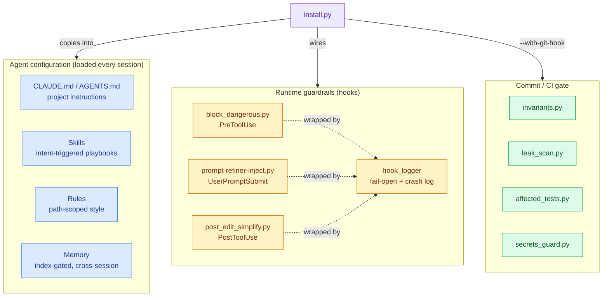

<div align="center">

# Agent Workbench

### Skills, rules, hooks, and tooling for running an AI coding agent reliably on a long-lived codebase

*Bộ công cụ + phương pháp luận làm việc với Claude Code — rút ra từ một codebase production thật, đã domain-stripped.*

[](https://github.com/doivamong/agent-workbench/actions/workflows/ci.yml)
[](LICENSE)
[](#at-a-glance)

<kbd>[Why](#why-this-exists)</kbd> · <kbd>[What's inside](#whats-inside)</kbd> · <kbd>[How it fits together](#how-it-fits-together)</kbd> · <kbd>[Quickstart](#quickstart-5-minutes)</kbd> · <kbd>[Install](#install-it-into-your-own-project)</kbd> · <kbd>[Honesty](#status--honesty)</kbd>

</div>

---

> **The problem.** Most Claude Code advice is toy examples. The hard part of using an AI
> agent isn't a clever one-off prompt — it's keeping the agent **consistent, safe, and
> on-pattern** across hundreds of sessions on a codebase you actually have to maintain.

> **The approach.** Encode the recurring decisions *once* — as intent-triggered skills,
> path-scoped rules, fail-open hooks, a carried-forward memory, and greppable invariant
> checks — so the agent re-derives them every session instead of you re-explaining them.

> **The result.** A copy-pasteable kit that installs into any project in one command and
> starts blocking dangerous shell commands, refining vague prompts, and gating commits
> immediately. Core is **stdlib-only**, the demos run in seconds, and CI is green.

<details>
<summary><b>New here? Start with the guided tour →</b></summary>

Read [`docs/getting-started.md`](docs/getting-started.md) for a guided walkthrough: clone,
run the three demos, then point the installer at one of your own projects. The rest of this
README is the reference map — skim the [What's inside](#whats-inside) table, then dive into
the [`<details>` deep-dives](#how-it-fits-together) only for the mechanisms you care about.

</details>

---

## Why this exists

> **Canonical statement:** the four tenets and the "what would betray this" review checklist live
> in [`PHILOSOPHY.md`](PHILOSOPHY.md) — the source of truth. This section is their narrative form.

This kit is the **generic, reusable layer** extracted from a real single-developer project —
the parts that have nothing to do with the original business domain and everything to do with
**making an AI coding agent reliable, safe, and consistent over a long-lived codebase.**

It is deliberately **domain-stripped**. Every business identifier, secret, machine path, and
piece of customer data has been removed and verified with a leak scanner (see
[`docs/SANITIZATION.md`](docs/SANITIZATION.md)). What remains is methodology you can lift.

> **Why it's public — and why it isn't about stars.** The codebase this came from can never be
> public; the methodology inside it is too useful to stay buried there for good. So it's shared
> for one plain reason: *let whoever needs it lift it, and skip the stumbling, the guesswork, and
> the avoidable mistakes it already cost to learn.* Success here isn't traction or attention — it
> is that the kit is **available, correct, and honest** the day someone reaches for it. If it
> spares one person an avoidable wrong turn — a stranger, or its own author starting the next
> codebase — it has done its job. That is the only scoreboard here.

> **Honesty is the deal, not decoration.** Because the point is to spare you avoidable pain, every
> tool states plainly what it does *not* do (see [Status & honesty](#status--honesty) and
> [`docs/SECURITY.md`](docs/SECURITY.md)). A guardrail that oversold itself would cause the exact
> stumble it is meant to prevent. The standard everywhere here: **best-fit, honest about limits,
> not gospel.**

**Who it's for** — solo developers (or tiny teams) who use an AI agent as their primary
pair-programmer, maintain code long enough that **consistency** and **guardrails** matter
more than raw speed, and want concrete copy-pasteable patterns instead of abstract advice.

## What's inside

A benefit-first map — *what it helps you do*, not an endpoint dump. Technical detail is
deferred to the linked paths and the [deep-dives below](#how-it-fits-together).

| When you need to… | What this gives you | Path |
|---|---|---|
| **Configure the agent itself** | Drop-in `CLAUDE.md` + `AGENTS.md` templates — short, high-signal project instructions loaded every session, portable across AI coding tools | [`CLAUDE.md`](CLAUDE.md) · [`AGENTS.md`](AGENTS.md) |
| **Encode reusable playbooks** | A skill system with anatomy, tiers, a registry, and **seven** runnable example skills — five **workflows** (plan-then-code, prompt-refiner, research, handover, stress-test) and two **guards** (review, debug) | [`.claude/skills/`](.claude/skills/) |
| **Carry context across sessions** | A file-based, index-gated memory the agent reloads each session — scaffold + example facts | [`memory/`](memory/) |
| **Catch common footguns** | Hooks that catch common destructive shell commands (whitespace/flag-order tolerant — a *seatbelt*, not a security boundary), flag vague prompts, nudge a simplify pass after a burst of edits, and wrap everything fail-open with crash logging | [`.claude/hooks/`](.claude/hooks/) |
| **Keep secrets encrypted at rest** | A dependency-free (stdlib-only) file encryptor — HMAC-CTR stream cipher + PBKDF2 — for keeping sensitive files encrypted in a private backup. A **custom stdlib construction, not an audited crypto library**; fine for at-rest backups, but use `age`/`sops`/libsodium if you have a real adversarial threat model (see [`docs/SECURITY.md`](docs/SECURITY.md)) | [`scripts/secrets_guard.py`](scripts/secrets_guard.py) |
| **Codify rules that must never break** | A tiny framework turning project invariants into fast, greppable checks you can wire into a pre-commit / CI gate | [`tools/invariants.py`](tools/invariants.py) |
| **Run only the relevant tests** | An AST-based "which tests does this change affect?" selector — faster CI than running everything | [`tools/affected_tests.py`](tools/affected_tests.py) |
| **Catch leaked secrets before commit** | A line-based secret/identifier *tripwire* with a private deny-list (catches common shapes + your own identifiers), an opt-in `--entropy` sweep for random-looking tokens, and `--respect-gitignore` to skip files that never ship — the commit-time seatbelt used to vet this export | [`tools/leak_scan.py`](tools/leak_scan.py) |
| **Keep memory honest** | A hygiene tripwire for the memory system — flags malformed frontmatter, dangling index links, orphan facts, broken `[[wiki-links]]`, and an oversized index | [`tools/memory_audit.py`](tools/memory_audit.py) |
| **Roll back a bad memory edit** | A manual snapshot/restore CLI for the memory store (which lives outside git, so `git checkout` can't save you) — snapshot before a risky mutation, restore *additively* if it goes wrong; manual-only, never a hook/cron | [`tools/memory_snapshot.py`](tools/memory_snapshot.py) |
| **Keep skills in sync** | A linter that catches drift between `skill-registry.md` and the `SKILL.md` files (a folder with no row, a row with no folder, frontmatter gaps, missing trigger markers) | [`tools/skill_lint.py`](tools/skill_lint.py) |
| **Catch file-set drift** | A manifest gate over the source-of-truth dirs (skills, hooks, rules, tools, scripts): adding or removing a file without updating its dependent docs/wiring fails CI. Paired with a `PostToolUse` hook that nudges you the moment a new file lands | [`tools/sync_manifest.py`](tools/sync_manifest.py) |
| **Watch the context budget** | An auditor for everything Claude Code loads each session (skills, agents, rules, the CLAUDE.md chain, MCP servers) — buckets each as always/sometimes/rarely and flags the heavy ones, so "short, high-signal context" gets a number (heuristic, not a real tokenizer) | [`tools/check_context_budget.py`](tools/check_context_budget.py) |
| **Catch an un-installed dependency** | A pre-commit *seatbelt* that warns (never blocks) when a commit adds a line to `requirements.txt`, so you remember to install it where the code runs before it fails at import | [`tools/check_requirements_diff.py`](tools/check_requirements_diff.py) |
| **Keep the agent on-style** | Rules for writing slash-commands consistently | [`.claude/rules/`](.claude/rules/) |
| **Run a real pre-commit gate** | A ready [`.pre-commit-config.yaml`](.pre-commit-config.yaml) wiring the leak scanner + invariant checks before every commit | [`.pre-commit-config.yaml`](.pre-commit-config.yaml) |
| **Try everything in 30 seconds** | Each tool ships a runnable `examples/` entry | [`examples/`](examples/) |

## How it fits together

The reusable core is a handful of small, independent pieces that the installer drops into a
target project. Nothing here is a framework — each part stands alone and is opt-in.



<details>
<summary><b>Deep-dive: the skill system (tiers, registry & example skills)</b></summary>

Skills are intent-triggered playbooks. The registry classifies each into a **tier** so the
agent knows which takes precedence when several match. Seven runnable example skills ship as
working references:

| Example skill | Tier | Fires when | Role |
|---|---|---|---|
| `example-plan-then-code` | workflow | "implement X", multi-file work needing a plan first | Orchestrates a full plan → implement → review flow |
| `example-review` | guard | "review my changes", before a non-trivial commit | Gates quality on changed code |
| `example-debug` | guard | "it's broken / erroring" with an unknown cause | Maps symptom → suspect files before any fix |
| `example-research` | workflow | "how should we / what's the best way", comparing approaches | Reads the code, compares ≥2 options, recommends before building |
| `prompt-refiner` | workflow | a vague, multi-part request (flagged by the `prompt-refiner-inject.py` hook) | Restates intent into a crisp spec before work starts |
| `example-handover` | workflow | ending a session, "package this for the next session / write a handover" | Packages settled work into artifacts a cold reader can execute |
| `example-stress-test` | workflow | "stress test this / what could go wrong / edge cases", before building or testing | Runs a change past fixed lenses for a GO/CAUTION/STOP verdict and an edge-case list |
| `example-output-guard` | guard | generating a whole file / large refactor | Stops truncation, placeholders, and "for brevity" stubs in long output |
| `example-using-skills` | meta | auto-injected each session; ≥2 skills could match, or unsure any applies | Routes to the right skill (tier precedence, match the object not the verb) |

The registry ([`.claude/skills/skill-registry.md`](.claude/skills/skill-registry.md)) is the
single grep-able index of trigger / do-not-trigger boundaries; the
[`SKILL_TEMPLATE.md`](.claude/skills/SKILL_TEMPLATE.md) is the starting point for your own.

</details>

<details>
<summary><b>Deep-dive: hooks are fail-open by design</b></summary>

Every hook is wrapped so that a crash **never blocks your workflow** — it logs to a JSONL
crash file and exits cleanly, rather than wedging the agent. The shipped hooks:

| Hook | Event | What it does |
|---|---|---|
| `block_dangerous.py` | `PreToolUse` (Bash) | Catches common destructive command shapes — `rm -rf` (any flag order/spacing), `find -delete`, `dd`, `mkfs`, fork bombs, force-push, `DROP TABLE`, … — and denies them via the documented hook contract. A **seatbelt against accidents, not a security boundary** (a determined operator can evade any string matcher). Adversarial evasion cases are in the test suite. |
| `prompt-refiner-inject.py` | `UserPromptSubmit` | Flags vague prompts to be refined before execution |
| `post_edit_simplify.py` | `PostToolUse` (Edit/Write) | After a burst of edits, nudges a simplification pass (dead code, unused imports, over-long functions, DRY). Throttled by a cooldown and a session TTL so it nudges occasionally, never spams. Advisory only — never blocks. |
| `precompact_backup.py` | `PreCompact` | Backs up the transcript and writes a `.last_compact` signal before a compaction, so context is recoverable even if you didn't save. |
| `compact_restore.py` | `SessionStart` (compact) | After a compaction, re-injects the top of the newest handover so the agent resumes with goal/decisions/next-steps. |
| `skill_routing_inject.py` | `SessionStart` (all) | Injects a compact, tier-ordered routing map derived from `skill-registry.md`, so the agent starts each session knowing which skill fires when. Output is kept small (it loads every session); pairs with the `example-using-skills` meta-skill. |
| `sync_guard.py` | `PostToolUse` (Write) | When a Write creates a *new* file in a watched source-of-truth dir, nudges you to update its dependents and regenerate the manifest. Distinguishes new-file from edit via `.claude/manifest.json`, so content edits stay quiet. Advisory; the deterministic gate is `tools/sync_manifest.py --check`. |
| `context_tracker.py` | `PostToolUse` (all) | As a session grows long, nudges you to `/compact` or to save a handover before limits hit. Throttled; counts are per-project. |

The fail-open wrapper lives in [`.claude/hooks/lib/hook_logger.py`](.claude/hooks/lib/hook_logger.py).
Run [`examples/hook_block_demo.py`](examples/hook_block_demo.py) to see the classifier decide.

</details>

## Generic vs. domain-specific — read this first

This kit is the **GENERIC** half of a larger private codebase. The table is honest about
what's transferable and what was intentionally left behind:

| Transferable (here) | Left behind (domain-specific, not shareable) |
|---|---|
| Hook architecture (fail-open, crash-logged) | Application routes + domain data-access code |
| `secrets_guard` crypto | The project's domain business logic |
| Invariant *framework* | The project's concrete invariant rules |
| Memory governance *model* | The actual memory corpus |
| Prompt-refiner *mechanism* | The project's domain prompt vocabulary |

## At a glance

<!-- BEGIN GENERATED:metrics (hand-maintained; run `python -m pytest --co -q` to recount tests) -->

| Signal | Value |
|---|---|
| Reusable core dependencies | **0** (stdlib-only) |
| Tests | **267**, green in CI (incl. adversarial evasion cases for the command guard) |
| Runnable demos | **12** (`examples/`) |
| Example skills | **7** (5 workflow + 2 guards) |
| Standalone tools | **10** (`invariants`, `affected_tests`, `leak_scan`, `secrets_guard`, `memory_audit`, `memory_snapshot`, `skill_lint`, `check_context_budget`, `check_requirements_diff`, `sync_manifest`) |

<!-- END GENERATED:metrics -->

> The test count is mirrored in three places (this row, the Quickstart comment, the footer).
> `tests/test_readme_metrics.py` guards against drift — it collects the suite and fails CI if any
> advertised number is stale, so the figure can't silently rot when you add tests.

## Quickstart (5 minutes)

```bash
git clone https://github.com/doivamong/agent-workbench
cd agent-workbench
python -m pip install -r requirements.txt   # stdlib-only core; deps are for examples/tests

# See it work (each runs in seconds):
python examples/secrets_demo.py     # encrypt/decrypt round-trip + tamper detection
python examples/hook_block_demo.py  # dangerous-command classifier
python examples/post_edit_simplify_demo.py  # the simplify-nudge classifier
python examples/invariant_demo.py   # the invariant gate
python examples/memory_audit_demo.py  # memory hygiene tripwire
python examples/skill_lint_demo.py    # registry/skill drift check
python examples/memory_snapshot_demo.py  # snapshot/restore a memory dir
python examples/context_budget_demo.py   # audit this repo's context budget
python examples/requirements_diff_demo.py # warn on a newly added dependency
python examples/affected_tests_demo.py   # pick only the tests a change affects
python examples/sync_manifest_demo.py     # file-set drift gate (added/removed files)

# Prove the tools actually work:
python -m pytest -q                 # 267 tests
```

## Install it into your own project

This is the part that makes it real, not just a reference. Point the installer at any project
and it copies the hooks, skills, rules, tools, `secrets_guard`, and the memory scaffold in, then
wires the hooks for you:

```bash
python install.py /path/to/your/project --with-git-hook --merge-settings
# --merge-settings deep-merges the hooks into .claude/settings.json (idempotent —
#   safe to re-run, preserves your other settings). Omit it to print the snippet
#   to paste yourself instead.
# --dry-run to preview first; --force to overwrite existing copied files.
```

With `--merge-settings` the hooks are active immediately; without it you paste the printed
snippet into `.claude/settings.json` yourself. Either way, opening that project in your agent
gives you, working immediately:

- **Dangerous `Bash` commands get blocked** (force-push, `rm -rf /`, `DROP TABLE`, …) via a
  real `PreToolUse` hook — verified against the documented hook I/O contract.
- **Vague prompts get flagged** to be refined first, via a `UserPromptSubmit` hook.
- **A git pre-commit gate** (`--with-git-hook`) that refuses to commit a leaked secret.
- **Drop-in skills** under `.claude/skills/` and a **working memory folder** under `memory/`.

Then make it yours: replace the example skills with your own, put your real rules in
[`tools/invariants.py`](tools/invariants.py), and list your project's identifiers in a private
deny-list for [`tools/leak_scan.py`](tools/leak_scan.py).

## Documentation

| Group | Key file | When to read |
|---|---|---|
| **Start here** | [`docs/getting-started.md`](docs/getting-started.md) | First clone — guided walkthrough |
| **Security** | [`docs/SECURITY.md`](docs/SECURITY.md) | What each guard does / does NOT defend against |
| **Blueprint** | [`docs/memory-governance.md`](docs/memory-governance.md) | Reference design for cross-session memory — the repo ships the `memory/` scaffold; the governance tooling is a model you implement |
| **Design + hooks** | [`docs/session-preservation.md`](docs/session-preservation.md) | Context handover on long projects — the automatic layers ship as hooks (PreCompact backup, post-compact restore, context-budget nudge); the `/session-save` commands and the HANDOVER you write stay manual |
| **Guide** | [`docs/sub-agents.md`](docs/sub-agents.md) | The sub-agent convention + the shipped `silent-failure-hunter` (an error-handling reviewer you spawn on demand; adapted from Anthropic's pr-review-toolkit, Apache-2.0) |
| **Guide** | [`docs/orchestration.md`](docs/orchestration.md) | How to delegate to sub-agents — when it pays off, briefing one that can't see your chat, a status protocol, and writing big outputs to disk |
| **Guide** | [`docs/lessons-as-rules.md`](docs/lessons-as-rules.md) | Turning a hard-won mistake into a path-scoped rule — the rule shape, promotion from memory, and the periodic anti-bloat cull |
| **Guide** | [`docs/development-rules.md`](docs/development-rules.md) | Everyday coding defaults (YAGNI/KISS/DRY, error handling, testing) — guidance, not law, and what yields when a path-scoped rule disagrees |
| **Guide** | [`docs/workflow.md`](docs/workflow.md) | Which skills to chain for which task type, and what the hooks fire on their own — the routing map over the skill set |
| **Pattern** | [`docs/patterns/config-access.md`](docs/patterns/config-access.md) | Two config-access traps — the wrong accessor for the execution context, and the silent-`None` nested-key bug that detonates far downstream |
| **Pattern** | [`docs/patterns/optimization-loop.md`](docs/patterns/optimization-loop.md) | Let a measurement, not intuition, decide each change — the measure → change → keep-or-revert-via-git loop, and the honest limit that it only fits measurable goals |
| **Blueprint** | [`docs/skills-as-cli.md`](docs/skills-as-cli.md) | Pattern for running a skill's playbook outside Claude Code (Cursor/Copilot/raw API) |
| **Provenance** | [`docs/SANITIZATION.md`](docs/SANITIZATION.md) | How the domain was stripped and verified |
| **Provenance** | [`THIRD_PARTY_NOTICES.md`](THIRD_PARTY_NOTICES.md) | Ports/derivatives and their obligations |

## Status & honesty

This is **best-fit as currently known, with better approaches left open** — not gospel. It
comes from *one* developer's context (solo, long-lived, AI-first). Your trade-offs may differ.
PRs that challenge a pattern are as welcome as PRs that extend one.

**On the guardrails specifically:** `block_dangerous.py` and `leak_scan.py` are **seatbelts, not
security boundaries.** They catch common accidental and obvious-malicious shapes; they do **not**
stop a determined operator (string matchers can be evaded via encoding or indirection; the
opt-in `leak_scan --entropy` pass catches random-looking tokens but a line scanner still can't
see everything). Use them to reduce footguns, not as your last line of defense.

## License

[MIT](LICENSE) for the original code. Several pieces are ports/derivatives of other open-source
work — see [`THIRD_PARTY_NOTICES.md`](THIRD_PARTY_NOTICES.md) for attribution and the
obligations that come with them.

## Contributing

See [`CONTRIBUTING.md`](CONTRIBUTING.md). The short version: this is a learning artifact, so
**"here's a better way" issues are the whole point.**

---

<div align="center">

**Agent Workbench** · stdlib-only core · 267 tests · MIT

🐍 Python · 🤖 Claude Code / AI agents · 🔒 fail-open guardrails

<sub>A domain-stripped methodology kit · best-fit, not gospel · MIT licensed</sub>

</div>
