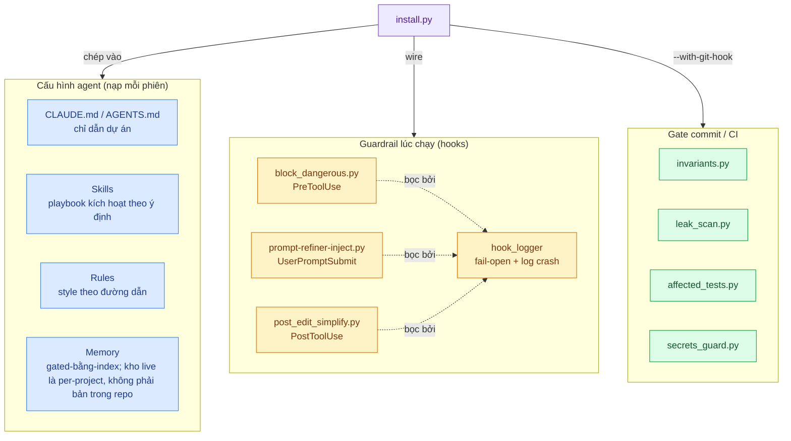

<div align="center">

# Agent Workbench — Bản tiếng Việt

### Skills, rules, hooks và tooling để chạy một agent lập trình AI một cách đáng tin trên codebase sống lâu dài

*Bộ công cụ + phương pháp luận làm việc với Claude Code — rút ra từ một codebase production thật, đã domain-stripped.*

</div>

> 🇬🇧 **Đây là bản dịch tiếng Việt.** Bản tiếng Anh — [`README.md`](../README.md) — là **nguồn chuẩn**:
> mọi con số ở đó được CI gate, còn trang này được bảo trì bằng tay. Nếu hai bản lệch nhau ở số
> liệu, **tin bản tiếng Anh**.

---

> **Vấn đề.** Phần lớn lời khuyên về Claude Code chỉ là ví dụ đồ chơi. Cái khó khi dùng một agent
> AI không phải là một prompt khéo léo dùng một lần — mà là giữ cho agent **nhất quán, an toàn và
> đúng pattern** qua hàng trăm phiên làm việc trên một codebase bạn thực sự phải bảo trì.

> **Cách tiếp cận.** Mã hoá các quyết định lặp lại *một lần* — dưới dạng skills kích hoạt theo ý
> định, rules gắn theo đường dẫn, hooks fail-open, một bộ nhớ mang theo qua các phiên, và các phép
> kiểm tra bất biến grep được — để agent **tự suy ra lại** chúng mỗi phiên thay vì bạn phải giải
> thích lại.

> **Kết quả.** Một bộ kit copy-dán được, cài vào dự án bất kỳ bằng một lệnh và bắt đầu chặn lệnh
> shell nguy hiểm, refine prompt mơ hồ, và gate commit ngay lập tức. Lõi **chỉ dùng stdlib**, các
> demo chạy trong vài giây, CI xanh.

<details>
<summary><b>Người mới? Bắt đầu bằng hướng dẫn có dẫn dắt →</b></summary>

Đọc [`docs/getting-started.md`](getting-started.md) để có một lượt đi có dẫn dắt: clone, chạy ba
demo, rồi trỏ installer vào một dự án của bạn. Phần còn lại của trang này là bản đồ tra cứu — lướt
bảng [Bên trong có gì](#bên-trong-có-gì), rồi chỉ đào sâu vào các khối `<details>` cho cơ chế bạn
quan tâm.

</details>

---

## Vì sao nó tồn tại

> **Phát biểu chuẩn:** bốn tenet và checklist review "điều gì sẽ phản bội nó" nằm trong
> [`PHILOSOPHY.md`](../PHILOSOPHY.md) — nguồn chân lý duy nhất. Mục này chỉ là dạng tường thuật của
> chúng (không lặp lại nguyên văn — bản tiếng Anh và file canon mới là nơi giữ câu chữ chuẩn).

Bộ kit này là **lớp generic, tái dùng được** trích ra từ một dự án một-lập-trình-viên thật — những
phần chẳng liên quan gì tới domain nghiệp vụ gốc và liên quan tất cả tới việc **làm cho một agent
lập trình AI đáng tin, an toàn và nhất quán trên một codebase sống lâu dài.**

Nó được **gỡ sạch domain một cách có chủ đích.** Mọi định danh nghiệp vụ, secret, đường dẫn máy, và
dữ liệu khách hàng đều đã được loại bỏ và kiểm chứng bằng một leak scanner (xem
[`docs/SANITIZATION.md`](SANITIZATION.md)). Cái còn lại là phương pháp luận bạn có thể nhấc đi.

> **Vì sao công khai — và vì sao không phải vì sao (star).** Codebase mà nó sinh ra từ đó không bao
> giờ công khai được; phương pháp luận bên trong thì quá hữu ích để chôn vùi ở đó mãi mãi. Nên nó
> được chia sẻ vì một lý do giản dị: *để ai cần thì nhấc nó lên dùng, và né những vấp váp, mò mẫm,
> sai lầm tránh được mà nó đã phải trả giá để học.* Thành công ở đây không phải là lượt truy cập hay
> sự chú ý — mà là bộ kit **có sẵn, đúng, và trung thực** vào ngày ai đó với tay tới nó. Nếu nó giúp
> một người né được một ngã rẽ sai tránh được — một người lạ, hoặc chính tác giả của nó khi bắt đầu
> codebase tiếp theo — thì nó đã làm xong việc. Đó là bảng điểm duy nhất ở đây.

> **Trung thực là cam kết, không phải trang trí.** Vì mục tiêu là giúp bạn né đau khổ tránh được,
> mỗi tool nói thẳng cái nó **không** làm (xem [Trạng thái & trung thực](#trạng-thái--trung-thực) và
> [`docs/SECURITY.md`](SECURITY.md)). Một guardrail tự thổi phồng sẽ gây đúng cái vấp mà nó lẽ ra
> phải ngăn. Chuẩn ở khắp nơi tại đây: **best-fit, honest about limits, not gospel.**

**Dành cho ai** — lập trình viên solo (hoặc nhóm nhỏ) coi agent AI là pair-programmer chính, bảo
trì code đủ lâu để **tính nhất quán** và **guardrail** quan trọng hơn tốc độ thuần, và muốn pattern
cụ thể copy-dán được thay vì lời khuyên trừu tượng.

## Bên trong có gì

Một bản đồ ưu-tiên-lợi-ích — *nó giúp bạn làm được gì*, không phải một bãi liệt kê endpoint. Chi
tiết kỹ thuật được dời sang các đường dẫn liên kết và các khối đào-sâu bên dưới.

| Khi bạn cần… | Cái này cho bạn | Đường dẫn |
|---|---|---|
| **Cấu hình chính agent** | Template `CLAUDE.md` + `AGENTS.md` thả-vào-là-dùng — chỉ dẫn dự án ngắn, đậm tín hiệu, nạp mỗi phiên, di động qua các công cụ AI | [`CLAUDE.md`](../CLAUDE.md) · [`AGENTS.md`](../AGENTS.md) |
| **Mã hoá playbook tái dùng** | Một hệ skill có anatomy, tiers, registry, và **mười sáu** skill chạy được trên cả năm tier — chín **workflow**, bốn **guard**, một **meta** router, một **feature**, một **audit** | [`.claude/skills/`](../.claude/skills/) |
| **Mang context qua các phiên** | Một scaffold memory dựa-trên-file, gated-bằng-index (ví dụ để bạn thay). Harness tự nạp `MEMORY.md` từ một đường dẫn per-project, **không** phải `memory/` của repo này — xem [memory-governance.md](memory-governance.md) | [`memory/`](../memory/) |
| **Bắt các footgun thường gặp** | Hooks bắt các lệnh shell huỷ-diệt thường gặp (chịu được khoảng trắng/thứ tự cờ — là *dây an toàn*, không phải ranh giới bảo mật), gắn cờ prompt mơ hồ, nhắc một lượt simplify sau loạt edit, và bọc mọi thứ fail-open kèm log crash | [`.claude/hooks/`](../.claude/hooks/) |
| **Giữ secret mã hoá khi nghỉ (at rest)** | Một bộ mã hoá file không-phụ-thuộc (stdlib-only) — HMAC-CTR stream cipher + PBKDF2 — để giữ file nhạy cảm được mã hoá trong backup riêng tư. Là một **cấu trúc stdlib tự chế, không phải thư viện crypto đã được audit**; ổn cho backup at-rest, nhưng hãy dùng `age`/`sops`/libsodium nếu bạn có mô hình đe doạ đối kháng thật (xem [`docs/SECURITY.md`](SECURITY.md)) | [`scripts/secrets_guard.py`](../scripts/secrets_guard.py) |
| **Mã hoá các rule không-được-vỡ** | Một framework nhỏ biến bất biến của dự án thành các phép kiểm nhanh, grep được, cắm vào gate pre-commit / CI | [`tools/invariants.py`](../tools/invariants.py) |
| **Chỉ chạy đúng test liên quan** | Một selector "thay đổi này ảnh hưởng test nào?" dựa trên AST — CI nhanh hơn chạy tất cả | [`tools/affected_tests.py`](../tools/affected_tests.py) |
| **Bắt secret rò rỉ trước khi commit** | Một *tripwire* secret/định-danh theo dòng với deny-list riêng (bắt các hình dạng thường gặp + định danh của bạn), một lượt quét `--entropy` tuỳ chọn cho token trông ngẫu nhiên, và `--respect-gitignore` để bỏ qua file không bao giờ ship — chính là dây an toàn lúc commit đã dùng để vet bản export này | [`tools/leak_scan.py`](../tools/leak_scan.py) |
| **Vet code bên thứ ba trước khi vendor** | Một *tripwire* license/attribution — grep một file hay cây thư mục tìm marker OSS-license, copyright và "adapted-from" rồi nói mỗi cái ngụ ý gì cho việc tái dùng. Giới hạn trung thực: nó đọc *marker*, không đọc *ý nghĩa* — kết quả sạch không phải bằng chứng nguyên tác | [`tools/license_scan.py`](../tools/license_scan.py) |
| **Giữ memory trung thực** | Một tripwire vệ sinh cho hệ memory — gắn cờ frontmatter hỏng, link index lủng lẳng, fact mồ côi, `[[wiki-link]]` gãy, và index quá khổ | [`tools/memory_audit.py`](../tools/memory_audit.py) |
| **Hoàn tác một sửa-memory tệ** | Một CLI snapshot/restore thủ công cho kho memory (vốn nằm ngoài git nên `git checkout` không cứu được) — snapshot trước một thao tác rủi ro, restore *cộng dồn* nếu hỏng; chỉ thủ công, không bao giờ là hook/cron | [`tools/memory_snapshot.py`](../tools/memory_snapshot.py) |
| **Công bố một lát memory an toàn công khai** | Một sync gated-bằng-leak, **fail-closed** — chỉ chép fact đánh dấu `visibility: public` (hoặc đã publish) mà qua được `leak_scan`, vào `memory/` của repo công khai; gỡ frontmatter per-session, để index do người tự sửa, chỉ chạy thủ công | [`tools/memory_sync.py`](../tools/memory_sync.py) |
| **Kiểm memory có thực sự tới agent** | Một tripwire wiring chỉ-đọc — harness tự nạp `MEMORY.md` từ một đường dẫn per-project, không phải `memory/` của repo này, nên fact curate ở sai thư mục sẽ âm thầm không bao giờ được recall. Gắn cờ sự lệch đó và một index live quá ngân sách; stat-verify mọi đường dẫn và không ghi gì | [`tools/memory_recall_doctor.py`](../tools/memory_recall_doctor.py) |
| **Giữ ngân-sách-tải memory một chỗ** | Nguồn chân lý duy nhất cho ngân sách tải của `MEMORY.md` (≤ 200 dòng / ~25 KB, vượt qua là các mục âm thầm bị cắt khỏi recall) — được audit + recall-doctor import để con số không lệch nhau (đã từng lệch `24576`→`25600`). Một module hằng số dùng chung, không phải CLI chạy được | [`tools/memory_budget.py`](../tools/memory_budget.py) |
| **Giữ skills đồng bộ** | Một linter bắt sự lệch giữa `skill-registry.md` và các file `SKILL.md` (thư mục không có dòng, dòng không có thư mục, thiếu frontmatter, thiếu trigger marker) | [`tools/skill_lint.py`](../tools/skill_lint.py) |
| **Bắt lệch file-set** | Một gate manifest trên các thư mục nguồn-chân-lý (skills, hooks, rules, tools, scripts): thêm hay bớt một file mà không cập nhật doc/wiring phụ thuộc sẽ fail CI. Đi kèm một hook `PostToolUse` nhắc bạn ngay khi một file mới rơi vào | [`tools/sync_manifest.py`](../tools/sync_manifest.py) |
| **Giữ các con số README trung thực** | Một generator/gate cho các con số "At a glance" (tests/demos/tools/skills): `--check` fail CI khi một con số cũ, `--write` tính lại từ cây thư mục — để hai nhánh thôi xung đột vì con số gõ tay. Gate các *con số*, không gate phần prose | [`tools/readme_metrics.py`](../tools/readme_metrics.py) |
| **Canh ngân sách context** | Một auditor cho mọi thứ Claude Code nạp mỗi phiên (skills, agents, rules, chuỗi CLAUDE.md, MCP server) — phân loại mỗi cái là always/sometimes/rarely và gắn cờ cái nặng, để "context ngắn, đậm tín hiệu" có một con số (heuristic, không phải tokenizer thật) | [`tools/check_context_budget.py`](../tools/check_context_budget.py) |
| **Bắt một phụ thuộc chưa cài** | Một *dây an toàn* pre-commit chỉ cảnh báo (không chặn) khi một commit thêm dòng vào `requirements.txt`, để bạn nhớ cài nó ở nơi code chạy trước khi nó fail lúc import | [`tools/check_requirements_diff.py`](../tools/check_requirements_diff.py) |
| **Xem skill nào thực sự được dùng** | Một prompt-logger tuỳ chọn + report cho thấy skill nào được dùng và cái nào là gánh nặng chết — để cắt bỏ hay sửa trigger. Proxy trung thực: nó đếm *lần nhắc tên*, không phải lần dùng thật | [`tools/skill_usage_report.py`](../tools/skill_usage_report.py) |
| **Mã hoá bẫy lặp lại thành rule** | Rule gắn-theo-đường-dẫn tự nạp khi bạn sửa một file khớp — kiểu slash-command, và measurement honesty (đừng tin một dấu xanh bạn chưa kiểm) | [`.claude/rules/`](../.claude/rules/) |
| **Chạy một gate pre-commit thật** | Một [`.pre-commit-config.yaml`](../.pre-commit-config.yaml) sẵn sàng, wire leak scanner + invariant trước mỗi commit | [`.pre-commit-config.yaml`](../.pre-commit-config.yaml) |
| **Thử mọi thứ trong 30 giây** | Mỗi tool đi kèm một mục `examples/` chạy được | [`examples/`](../examples/) |

## Cách chúng khớp với nhau

Lõi tái dùng là một nhúm mảnh nhỏ, độc lập, mà installer thả vào dự án đích. Không gì ở đây là một
framework — mỗi phần đứng riêng được và là opt-in.



<details>
<summary><b>Đào sâu: hệ skill (tiers, registry & skills)</b></summary>

Skills là playbook kích hoạt theo ý định. Registry phân loại mỗi skill vào một **tier** để agent
biết cái nào thắng khi nhiều cái cùng khớp. Mười sáu skill chạy được ship như các tham chiếu hoạt
động:

| Skill | Tier | Kích hoạt khi | Vai trò |
|---|---|---|---|
| `awb-plan-then-code` | workflow | "implement X", việc nhiều-file cần plan trước | Điều phối luồng plan → implement → review đầy đủ |
| `awb-review` | guard | "review my changes", trước một commit không tầm thường | Gate chất lượng trên code đã đổi |
| `awb-debug` | guard | "nó hỏng / lỗi" mà chưa rõ nguyên nhân | Ánh xạ triệu chứng → file nghi ngờ trước khi sửa |
| `awb-research` | workflow | "nên làm thế nào / cách tốt nhất", so sánh phương án | Đọc code, so ≥2 lựa chọn, khuyến nghị trước khi xây |
| `prompt-refiner` | workflow | một request mơ hồ, nhiều phần (do hook `prompt-refiner-inject.py` gắn cờ) | Diễn đạt lại ý định thành spec rõ trước khi bắt đầu |
| `awb-handover` | workflow | kết phiên, "đóng gói cho phiên sau / viết handover" | Đóng gói việc đã chốt thành artifact một người đọc lạnh thực thi được |
| `awb-stress-test` | workflow | "stress test cái này / điều gì có thể hỏng / edge case", trước khi xây hoặc test | Cho một thay đổi qua các lăng kính cố định để ra phán quyết GO/CAUTION/STOP và danh sách edge-case |
| `awb-output-guard` | guard | sinh cả file / refactor lớn | Chặn cắt cụt, placeholder, và stub "for brevity" trong output dài |
| `awb-using-skills` | meta | auto-inject mỗi phiên; ≥2 skill có thể khớp, hoặc không chắc | Dẫn tới đúng skill (tier ưu tiên, khớp đối tượng không phải động từ) |
| `awb-config-guard` | guard | viết code đọc config (key lồng nhau, hoặc đọc cross-context) | Lớp tư vấn trên invariant `config-flat-access` xác định — bắt bẫy silent-None |
| `awb-tdd` | workflow | "làm TDD / test-first / red-green-refactor" | Một test fail → code tối thiểu → lặp, theo lát dọc; canh bẫy silent-skip |
| `awb-cook` | workflow | "cook cái này / full workflow có checkpoint / plan từ vài góc" | Oversight bậc thang + plan đa góc nhìn, điều phối các guard skill |
| `awb-external-ref` | workflow | sắp copy/adapt code ngoài ("dùng được không / port cái này") | Phân loại license → port-kèm-notice hay salvage-ý-tưởng; kiểm injection + supply-chain |
| `awb-optimize` | feature | "chậm quá / optimize / cắt latency" với mục tiêu đo được | Baseline → đo → sửa bottleneck top → đo lại → bảng before/after |
| `awb-dead-code-audit` | audit | "tìm code chết / không dùng", một lượt prune sau refactor | Gọi một symbol là chết chỉ khi mọi cross-check độc lập đều rỗng; không bao giờ tự xoá |
| `awb-lessons-capture` | workflow | cuối phiên, "thu hoạch bài học / memory retro", sau một bug bất ngờ hay một chỉnh sửa | Khai thác phiên tìm bài học bền, chấm điểm mỗi cái, chỉ ghi cái được duyệt vào memory live |

Registry ([`.claude/skills/skill-registry.md`](../.claude/skills/skill-registry.md)) là chỉ mục
grep được duy nhất về ranh giới trigger / do-not-trigger;
[`SKILL_TEMPLATE.md`](../.claude/skills/SKILL_TEMPLATE.md) là điểm khởi đầu cho skill của bạn.

</details>

<details>
<summary><b>Đào sâu: hooks fail-open theo thiết kế</b></summary>

Mỗi hook được bọc sao cho một lần crash **không bao giờ chặn workflow của bạn** — nó log vào một
file crash JSONL và thoát sạch, thay vì kẹt agent. Các hook ship sẵn:

| Hook | Sự kiện | Làm gì |
|---|---|---|
| `block_dangerous.py` | `PreToolUse` (Bash) | Bắt các hình dạng lệnh huỷ-diệt thường gặp — `rm -rf` (mọi thứ tự cờ/khoảng trắng), `find -delete`, `dd`, `mkfs`, fork bomb, force-push, `DROP TABLE`, … — và từ chối chúng qua hook contract đã ghi. Một **dây an toàn chống tai nạn, không phải ranh giới bảo mật** (một người vận hành quyết tâm né được mọi bộ khớp chuỗi). Ca né đối kháng nằm trong test suite. |
| `prompt-refiner-inject.py` | `UserPromptSubmit` | Gắn cờ prompt mơ hồ để refine trước khi thực thi |
| `post_edit_simplify.py` | `PostToolUse` (Edit/Write) | Sau loạt edit, nhắc một lượt simplify (code chết, import thừa, hàm quá dài, DRY). Bị tiết chế bằng cooldown và session TTL nên chỉ nhắc thưa, không spam. Chỉ tư vấn — không bao giờ chặn. |
| `precompact_backup.py` | `PreCompact` | Backup transcript và ghi tín hiệu `.last_compact` trước một lần compact, để context khôi phục được kể cả khi bạn chưa lưu. |
| `compact_restore.py` | `SessionStart` (compact) | Sau một lần compact, re-inject phần đầu của handover mới nhất để agent tiếp tục với goal/quyết-định/bước-tiếp. |
| `skill_routing_inject.py` | `SessionStart` (mọi) | Inject một bản đồ routing gọn, xếp theo tier, dẫn xuất từ `skill-registry.md`, để agent bắt đầu mỗi phiên biết skill nào kích hoạt khi nào. Output giữ nhỏ (nạp mỗi phiên); đi cặp với meta-skill `awb-using-skills`. |
| `session_start.py` | `SessionStart` (startup\|resume\|clear) | Inject project primer (`.claude/session-primer.md`) — một con trỏ ngắn, ổn định ("bạn có skills; đây là registry; chọn theo trigger marker") — ở đầu mỗi phiên, và hiện breadcrumb mà `session_end.py` ghi thành dòng "Last session: …". **Không** kích hoạt khi `compact` (đó là việc của `compact_restore.py`). Kill-switch `SESSION_PRIMER=0`. |
| `sync_guard.py` | `PostToolUse` (Write) | **Chỉ-maintainer — không được installer wire** (gate `tools/sync_manifest.py` và `.claude/manifest.json` ship cùng kit, không vào dự án adopter, nên wire ở đó chỉ làm phiền). Khi một Write tạo một file *mới* trong thư mục nguồn-chân-lý được canh, nhắc cập nhật phụ thuộc và regen manifest. Phân biệt file-mới với edit qua `.claude/manifest.json` nên sửa nội dung vẫn im. Tư vấn; gate xác định là `tools/sync_manifest.py --check`. |
| `context_tracker.py` | `PostToolUse` (mọi) | Khi phiên dài ra, nhắc `/compact` hoặc lưu handover trước khi chạm giới hạn. Bị tiết chế; đếm theo per-project. |
| `session_end.py` | `SessionEnd` | Ghi một breadcrumb một dòng (git branch, commit cuối, số file chưa commit, thời gian) khi một phiên kết thúc; `session_start.py` hiện nó lần sau thành dòng "Last session: …". Một bổ trợ nhẹ, tự động cho handover viết tay — định hướng, không phải phát lại. Kill-switch `SESSION_BREADCRUMB=0`. |
| `skill_usage_logger.py` | `UserPromptSubmit` | **Opt-in — không wire mặc định.** Log skill nào một prompt nhắc tên (một `/<skill>` tường minh là "invoke" mạnh, tên trơ là "mention" yếu) vào một JSONL local, gitignored cho [`tools/skill_usage_report.py`](../tools/skill_usage_report.py) tổng kết. Bật bằng cách thêm nó vào chuỗi `UserPromptSubmit` trong `.claude/settings.json`. |

Bộ bọc fail-open nằm ở [`.claude/hooks/lib/hook_logger.py`](../.claude/hooks/lib/hook_logger.py).
Chạy [`examples/hook_block_demo.py`](../examples/hook_block_demo.py) để xem bộ phân loại quyết định.

</details>

## Generic vs. domain-specific — đọc cái này trước

Bộ kit này là nửa **GENERIC** của một codebase riêng tư lớn hơn. Bảng dưới trung thực về cái gì
chuyển đi được và cái gì cố ý để lại:

| Chuyển đi được (ở đây) | Để lại (domain-specific, không chia sẻ được) |
|---|---|
| Kiến trúc hook (fail-open, log-crash) | Route ứng dụng + code truy cập dữ liệu domain |
| Crypto `secrets_guard` | Logic nghiệp vụ domain của dự án |
| *Framework* invariant | Rule invariant cụ thể của dự án |
| *Mô hình* governance memory | Kho memory thật |
| *Cơ chế* prompt-refiner | Từ vựng prompt domain của dự án |

## At a glance (số liệu)

> 🇻🇳 *Các con số dưới đây là bản phản chiếu của bảng "At a glance" trong [`README.md`](../README.md),
> nơi chúng được CI gate (`readme_metrics --check`). Trang này không được gate — nếu lệch, tin bản
> tiếng Anh.*

| Tín hiệu | Giá trị |
|---|---|
| Phụ thuộc của lõi tái dùng | **0** (chỉ stdlib) |
| Tests | **405**, xanh trong CI (gồm cả ca né đối kháng cho command guard) |
| Demo chạy được | **17** (`examples/`) |
| Skills | **16** (9 workflow + 4 guard + 1 meta + 1 feature + 1 audit) |
| Tool độc lập | **16** (15 trong `tools/` + `secrets_guard` ở `scripts/`) |

## Quickstart (5 phút)

```bash
git clone https://github.com/doivamong/agent-workbench
cd agent-workbench
python -m pip install -r requirements.txt   # lõi chỉ stdlib; deps là cho examples/tests

# Xem nó chạy (mỗi cái vài giây):
python examples/secrets_demo.py     # mã hoá/giải mã round-trip + phát hiện giả mạo
python examples/hook_block_demo.py  # bộ phân loại lệnh nguy hiểm
python examples/post_edit_simplify_demo.py  # bộ phân loại nhắc-simplify
python examples/invariant_demo.py   # gate invariant
python examples/memory_audit_demo.py  # tripwire vệ sinh memory
python examples/skill_lint_demo.py    # kiểm lệch registry/skill
python examples/memory_snapshot_demo.py  # snapshot/restore một thư mục memory
python examples/memory_recall_doctor_demo.py  # memory curate có tới agent không?
python examples/context_budget_demo.py   # audit ngân sách context của repo này
python examples/requirements_diff_demo.py # cảnh báo một phụ thuộc mới thêm
python examples/affected_tests_demo.py   # chỉ chọn test mà thay đổi ảnh hưởng
python examples/sync_manifest_demo.py     # gate lệch file-set (thêm/bớt file)

# Chứng minh các tool thực sự hoạt động:
python -m pytest -q                 # 405 tests
```

## Cài vào dự án của bạn

Đây là phần làm cho nó thật, không chỉ là tham chiếu. Trỏ installer vào dự án bất kỳ và nó chép
hooks, skills, rules, các tool hướng-dự-án (8 trong số 15 ở `tools/` — 7 cái còn lại là tool
bảo-trì-repo ở lại trong kit), `secrets_guard` (cái tool độc lập thứ 16 đếm ở "At a glance" — nó
nằm ở `scripts/`, không phải `tools/`), và scaffold memory vào, rồi wire hooks cho bạn:

```bash
python install.py /path/to/your/project --with-git-hook --merge-settings
# --merge-settings deep-merge các hook vào .claude/settings.json (idempotent —
#   chạy lại an toàn, giữ nguyên các setting khác). Bỏ nó đi để in đoạn snippet
#   cho bạn tự dán.
# --dry-run để xem trước; --force để ghi đè file đã chép.
```

Với `--merge-settings`, các hook của installer hoạt động ngay — mọi hook trong bảng trên trừ
`sync_guard` chỉ-maintainer và `skill_usage_logger` opt-in; không có nó thì bạn tự dán đoạn snippet
in ra vào `.claude/settings.json`. Dù cách nào, mở dự án đó bằng agent là bạn có ngay, hoạt động
liền:

- **Lệnh `Bash` nguy hiểm bị chặn** (force-push, `rm -rf /`, `DROP TABLE`, …) qua một hook
  `PreToolUse` thật — đã kiểm chứng với hook I/O contract đã ghi.
- **Prompt mơ hồ bị gắn cờ** để refine trước, qua một hook `UserPromptSubmit`.
- **Một gate git pre-commit** (`--with-git-hook`) từ chối commit một secret rò rỉ.
- **Skills thả-vào** dưới `.claude/skills/` và một **thư mục memory hoạt động** dưới `memory/`.

Rồi biến nó thành của bạn: thay các skill này bằng của bạn, đặt rule thật vào
[`tools/invariants.py`](../tools/invariants.py), và liệt kê định danh của dự án bạn trong một
deny-list riêng cho [`tools/leak_scan.py`](../tools/leak_scan.py).

## Tài liệu

| Nhóm | File chính | Khi nào đọc |
|---|---|---|
| **Bắt đầu ở đây** | [`docs/getting-started.md`](getting-started.md) | Lần clone đầu — hướng dẫn có dẫn dắt |
| **Bản đồ** | [`SKILL_CATALOG.md`](../SKILL_CATALOG.md) | Toàn bộ taxonomy năng lực — mỗi skill/hook/doc/placeholder gắn nhãn LIVE / BLUEPRINT / ADOPTER-FILLS / REJECTED |
| **Bảo mật** | [`docs/SECURITY.md`](SECURITY.md) | Mỗi guard bảo vệ / KHÔNG bảo vệ điều gì |
| **Blueprint** | [`docs/memory-governance.md`](memory-governance.md) | Thiết kế tham chiếu cho memory xuyên-phiên — repo ship scaffold `memory/`; tooling governance là một mô hình bạn tự dựng |
| **Thiết kế + hooks** | [`docs/session-preservation.md`](session-preservation.md) | Handover context trên dự án dài — lớp tự động ship dưới dạng hook; lệnh `/session-save` và HANDOVER bạn viết vẫn thủ công |
| **Hướng dẫn** | [`docs/sub-agents.md`](sub-agents.md) | Quy ước sub-agent + `silent-failure-hunter` ship sẵn (một reviewer xử-lý-lỗi bạn spawn khi cần; phỏng theo pr-review-toolkit của Anthropic, Apache-2.0) |
| **Hướng dẫn** | [`docs/orchestration.md`](orchestration.md) | Cách uỷ thác cho sub-agent — khi nào đáng, brief một cái không thấy được chat của bạn, một protocol trạng thái, và ghi output lớn ra đĩa |
| **Hướng dẫn** | [`docs/lessons-as-rules.md`](lessons-as-rules.md) | Biến một sai lầm khó-thắng thành một rule theo-đường-dẫn — hình dạng rule, promote từ memory, và lượt cull chống phình định kỳ |
| **Hướng dẫn** | [`docs/development-rules.md`](development-rules.md) | Mặc định coding hằng ngày (YAGNI/KISS/DRY, xử lý lỗi, test) — hướng dẫn, không phải luật, và cái gì nhường khi một rule theo-đường-dẫn bất đồng |
| **Hướng dẫn** | [`docs/workflow.md`](workflow.md) | Chuỗi skill nào cho loại việc nào, và hook tự bắn cái gì — bản đồ routing trên bộ skill |
| **Hướng dẫn** | [`docs/architecture-vocabulary.md`](architecture-vocabulary.md) | Một từ vựng nhỏ, không-domain cho chất lượng *cấu trúc* — module sâu vs nông, seam, deletion test, interface-as-test-surface |
| **Blueprint** | [`docs/ui-redesign-workflow.md`](ui-redesign-workflow.md) | Redesign UI như một workflow có gate (toggle admin + public) — đẩy các kiểm tra rẻ lên trước; ship phương pháp, bạn điền brand |
| **Hướng dẫn** | [`docs/design-discipline.md`](design-discipline.md) | Làm chất lượng UI tường minh, không phải cảm tính — các núm thiết kế số, một audit scan→diagnose→fix, rule chống AI-slop, a11y/perf như luật cứng |
| **Hướng dẫn** | [`docs/external-tool-reliability.md`](external-tool-reliability.md) | Chỉ tin một tool phân tích ngoài sau khi benchmark nó — cấm các query 0%-đúng, degrade nhẹ về grep |
| **Hướng dẫn** | [`docs/pre-commit-failure-modes.md`](pre-commit-failure-modes.md) | Một gate commit biết học — một registry failure-mode chỉ-thêm cùng phân tầng tư-vấn-vs-chặn |
| **Hướng dẫn** | [`docs/windows-agent-gotchas.md`](windows-agent-gotchas.md) | Lỗi âm thầm riêng khi chạy agent trên Windows — `.bat` bị `cmd /c` nuốt, headless `sys.stdout=None`, "restart không ăn" (PID cũ/elevation), `requirements.txt` ≠ đã deploy |
| **Pattern** | [`docs/patterns/config-access.md`](patterns/config-access.md) | Hai bẫy truy cập config — sai accessor cho context thực thi, và bug key-lồng silent-`None` phát nổ ở xa hạ nguồn |
| **Pattern** | [`docs/patterns/optimization-loop.md`](patterns/optimization-loop.md) | Để một phép đo, không phải trực giác, quyết mỗi thay đổi — vòng đo → đổi → giữ-hoặc-revert-qua-git, và giới hạn trung thực rằng nó chỉ hợp mục tiêu đo được |
| **Pattern** | [`docs/patterns/boundary-coherence.md`](patterns/boundary-coherence.md) | Khi bạn đổi một phía của biên producer↔consumer, đọc phía kia — lệch contract ở đó fail âm thầm (render trắng, `None` âm thầm, một no-op) và một test một-phía vẫn pass |
| **Blueprint** | [`docs/skills-as-cli.md`](skills-as-cli.md) | Pattern chạy playbook của một skill ngoài Claude Code (Cursor/Copilot/raw API) |
| **Xuất xứ** | [`docs/SANITIZATION.md`](SANITIZATION.md) | Cách domain bị gỡ và kiểm chứng |
| **Xuất xứ** | [`THIRD_PARTY_NOTICES.md`](../THIRD_PARTY_NOTICES.md) | Các port/dẫn xuất và nghĩa vụ của chúng |

## Trạng thái & trung thực

Đây là **best-fit theo hiểu biết hiện tại, để ngỏ cho cách tốt hơn** — không phải chân lý. Nó đến
từ context của *một* lập trình viên (solo, sống lâu, AI-first). Đánh đổi của bạn có thể khác. PR
thách thức một pattern cũng được hoan nghênh như PR mở rộng một cái.

**Riêng về các guardrail:** `block_dangerous.py` và `leak_scan.py` là **dây an toàn, không phải
ranh giới bảo mật.** Chúng bắt các hình dạng vô tình thường gặp và độc-hại-hiển-nhiên; chúng **không**
chặn một người vận hành quyết tâm (bộ khớp chuỗi có thể né qua encoding hoặc gián tiếp; lượt
`leak_scan --entropy` tuỳ chọn bắt token trông ngẫu nhiên nhưng một line scanner vẫn không thấy
được mọi thứ). Dùng chúng để giảm footgun, không phải làm tuyến phòng thủ cuối.

## License

[MIT](../LICENSE) cho code gốc. Vài mảnh là port/dẫn xuất của công trình open-source khác — xem
[`THIRD_PARTY_NOTICES.md`](../THIRD_PARTY_NOTICES.md) cho attribution và nghĩa vụ đi kèm.

## Đóng góp

Xem [`CONTRIBUTING.md`](../CONTRIBUTING.md). Bản ngắn: đây là một artifact học tập, nên các issue
kiểu **"đây là cách tốt hơn" chính là toàn bộ ý nghĩa.**

---

<div align="center">

**Agent Workbench** · lõi chỉ-stdlib · 405 tests · MIT

🐍 Python · 🤖 Claude Code / AI agents · 🔒 guardrail fail-open

<sub>Một bộ kit phương pháp luận đã domain-stripped · best-fit, không phải chân lý · MIT</sub>

</div>
